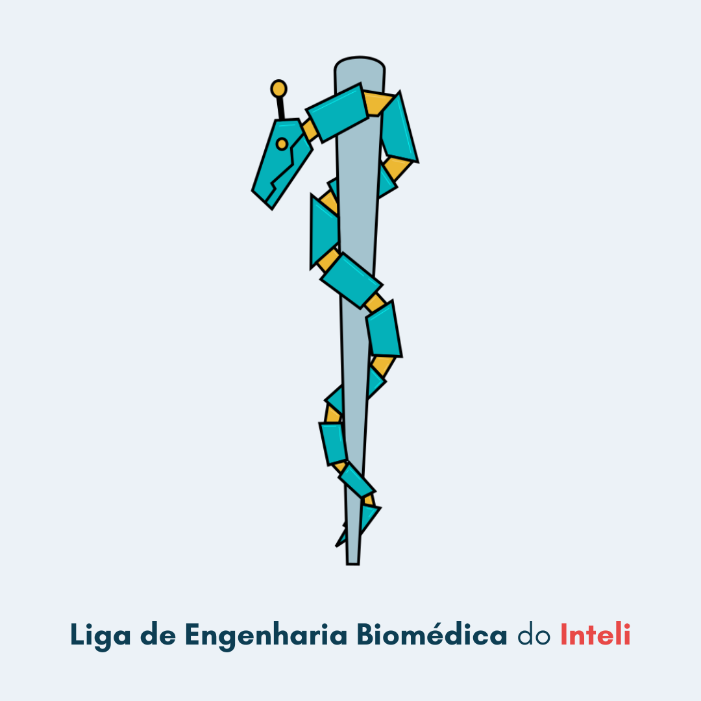

# MedIn - Liga de Engenharia Biomédica do Inteli

 

> A Liga de Engenharia Biomédica do Inteli é a primeira organização estudantil da entidade que tem como objetivo desenvolver produtos na interseção entre tecnologia/engenharia e a área de saúde.
